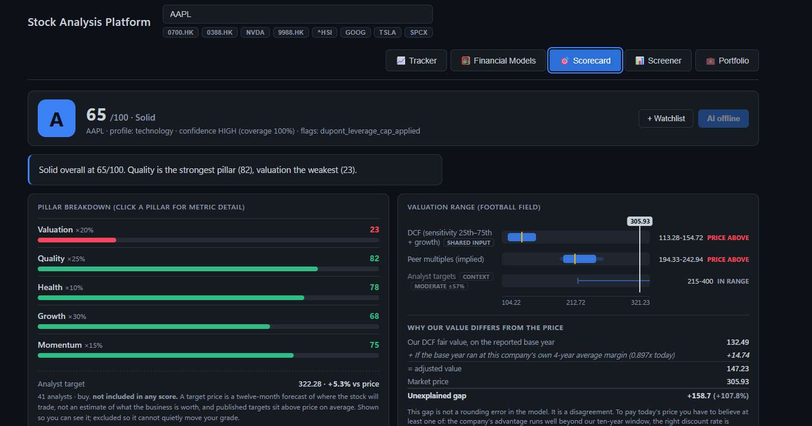
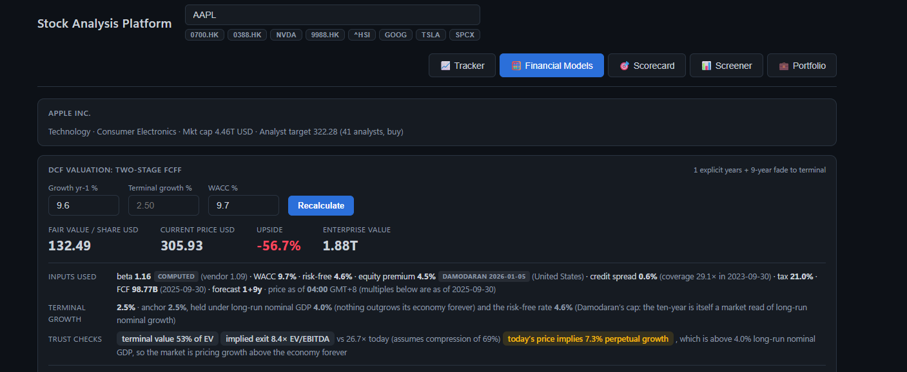
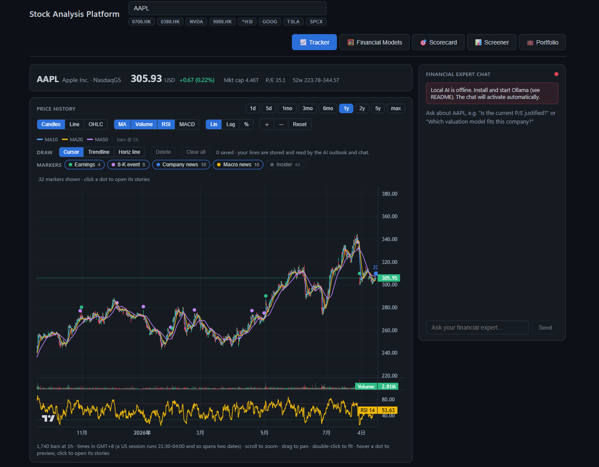
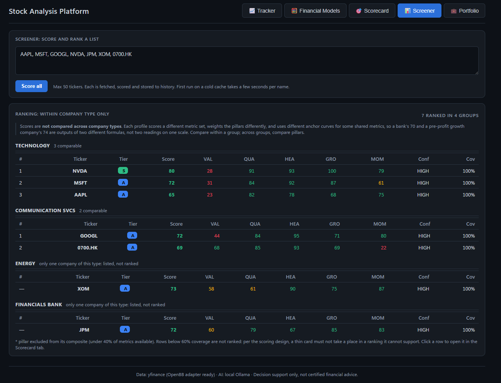
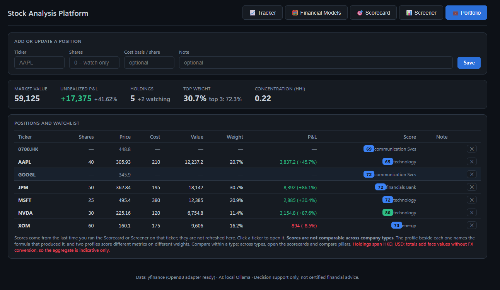

# Auditable Valuation

[](https://github.com/Gerald-ger/auditable-valuation/actions/workflows/ci.yml)
[](#tests)
[](LICENSE)
[](#prerequisites)

**Investment-banking valuation models as auditable code.** A two-stage FCFF DCF, an excess
return model for banks and insurers, a per-share dividend discount model for REITs, trading
comps and a deterministic 0–100 scorecard, for US and Hong Kong listings. Everything runs on
your own machine; an optional local LLM explains the numbers without sending them anywhere.



**Scorecard** — every company gets a 0-100 composite built from five weighted pillars, with
each metric's raw value and its score shown side by side. The weights change with the
company's classification, so a bank is not judged on the ratios that suit a software firm.
The football field underneath places today's price against DCF, comps and analyst ranges.

> **Decision support only — not certified financial advice.**
> [Read the limitations](docs/limitations.md) before relying on any number here — each one
> carries the measurement that established it.

**The interesting part is where the model disagrees with the market.** In the Financial Models
screenshot below, AAPL's own price implies a **7.3% perpetual growth rate, against an economy
that grows 4%**. Nothing here closes that gap. The app reports its size, names what you would
have to believe to pay today's price anyway, and leaves the disagreement on screen — because a
model tuned until it agreed with the price would only be telling you the price.

Every assumption carries the source it came from, down to the vintage of the equity risk
premium. The suite runs entirely offline against committed fixtures, so the numbers here are
reproducible rather than asserted. The method is in
[docs/financial-models-reference.md](docs/financial-models-reference.md); every correction
since, with its measured before and after, is in [CHANGELOG.md](CHANGELOG.md). What is
still open — ranked, each with the trigger that would make it worth doing — is in
[TODOLIST.md](TODOLIST.md), and what is done against what is deliberately *not*, for running
this yourself, is in [docs/release-readiness.md](docs/release-readiness.md).

> ### Want to see it work before setting any of this up?
>
> **`start-demo.bat`** (Windows) or **`./start-demo.sh`** runs the Scorecard and Financial
> Models engine against eight companies' real, committed financial statements — **no API key, no
> network, no Ollama, and nothing to configure**. The numbers are reproducible because the
> data is frozen: they are the same bytes the test suite pins its golden scores to.
>
> It does still need the install below — it removes the *configuration*, not the
> toolchain. Three of the six tabs are withheld, and it says so on screen. Details:
> [Demo mode](#demo-mode--no-api-key-no-network-no-ollama).

## Contents

| | |
|---|---|
| [What it looks like](#what-it-looks-like) | the other four tabs |
| [Prerequisites](#prerequisites) · [Install](#install) · [Run it](#run-it) | getting it going |
| [Demo mode](#demo-mode--no-api-key-no-network-no-ollama) | eight companies, no key, no network |
| [Architecture](#architecture) | how the pieces fit |
| [Tests](#tests) | 1008 offline, and what they are for |
| [Project structure](#project-structure) | where everything lives |
| [Licence and data provenance](#licence-and-data-provenance) | AGPL-3.0, and what it does not cover |

**Deeper than this file goes:** [features tab by tab](docs/features.md) ·
[limitations](docs/limitations.md) · [credentials](docs/credentials.md) ·
[tests](docs/testing.md) · [hosting and development](docs/development.md) ·
[the method itself](docs/financial-models-reference.md)

## What it looks like



**Financial Models** — a two-stage FCFF DCF you can audit rather than trust. Every assumption
carries the source it came from, down to the vintage of the equity risk premium. The trust
checks then turn the model on itself: how much of the value sits in the terminal year, what
exit multiple that implies, and what perpetual growth rate today's price would require — the
7.3% above, highlighted in the trust-checks row.

**And the DCF is not the only model on this tab.** A discounted cash flow does not fit every
company: a bank has no `CFO - CapEx` to discount, and a REIT's capital expenditure is
acquisition rather than maintenance. Those types get the model that does fit, chosen from the
same classification the scorecard uses - **excess return** (book equity plus the present value
of the spread between return on equity and cost of equity) for banks and insurers, and a
**two-stage dividend discount, computed per share**, for REITs. Per share rather than in
aggregate because REITs fund acquisitions by issuing equity: on `O` the share count grew 41.4%
over four years, so the aggregate dividend compounds at 17.22% against 4.43% for the dividend
per share, and valuing the aggregate would credit today's holder with dividends somebody else
paid for.

Each carries the same editable assumptions the DCF does - the driver, terminal growth and cost
of equity - through `POST /api/stock/{ticker}/intrinsic`. **And each may refuse.** On `O` the
dividend model declines outright: a beta regression of 0.4263 (R-squared 0.148) puts the cost
of equity at 6.20% against a 7.30% pre-tax cost of debt, and a lender ranks ahead of a
shareholder, so no fair value is reported rather than one built on a rate the company could
not raise equity at. The inputs sit above that refusal rather than below it, so a reader who
thinks the regression is an artefact of a weak fit can supply a rate and see what the model
does with it.



**Tracker** — candles with moving averages, RSI and MACD, SEC filing markers on the timeline,
and the news that explains a move. Drawings persist and are fed to the AI as context.



**Screener** — the same deterministic engine run over a watchlist, grouped by classification
so like is compared with like.



**Portfolio** — holdings and watchlist with position weights and concentration. The positions
shown are fabricated for the screenshot.

## Prerequisites

| | |
|---|---|
| **Python 3.12, 3.13 or 3.14** | The floor is `requires-python = ">=3.12"` in `pyproject.toml`, so `pip install -e .` stops with a clear version message rather than failing obscurely later. **3.12 is where `numpy==2.5.1` stops** — it declares `Python>=3.12`, so on 3.11 the resolve fails on that pin, not on anything this project wrote. All three are exercised on every push ([ci.yml](.github/workflows/ci.yml)), and the 107-pin runtime set is resolved under all three weekly ([runtime-install.yml](.github/workflows/runtime-install.yml)), so the floor cannot quietly stop being true. **No upper bound is declared**, but 3.15.0b4 does not work today: eight of the pins have no cp315 wheel yet and pip stops on the first that needs a C compiler. That is the ecosystem catching up, and it will stop being true on its own. Until 2026-08-28 this said `>=3.14` and hedged that 3.12 and 3.13 "may well work"; the analysis was right and [the measurement](CHANGELOG.md) has replaced it. |
| **Node 20.19+ or 22.12+** | The odd-looking floor is the toolchain's own, not a preference: Vite 8, oxlint and `@vitejs/plugin-react` all declare `^20.19.0 \|\| >=22.12.0`. Mirrored in `engines` in [frontend/package.json](frontend/package.json). npm warns rather than refuses unless you set `engine-strict`, so on 22.0–22.11 `npm install` still reports success and you find out later, if at all. Nobody has run that range — developed on 24, CI on 22 (which resolves to a 22.12+ release), so it is untested rather than known-broken. |
| Ollama | Optional. The AI features disable cleanly without it and everything else works — see [Install guidance](#install-guidance). |
| FMP API key | Optional, free tier. Without one you lose automatic peer discovery and nothing else — see [Credentials](#credentials). |

## Install

**Windows (PowerShell)**

```powershell
git clone https://github.com/Gerald-ger/auditable-valuation.git
cd auditable-valuation

python -m venv backend\.venv
backend\.venv\Scripts\python.exe -m pip install -e .
backend\.venv\Scripts\python.exe -m pip install -r backend\requirements.txt

cd frontend; npm install; cd ..
```

**macOS / Linux**

```bash
git clone https://github.com/Gerald-ger/auditable-valuation.git
cd auditable-valuation

python3 -m venv backend/.venv
backend/.venv/bin/python -m pip install -e .
backend/.venv/bin/python -m pip install -r backend/requirements.txt

(cd frontend && npm install)
```

The only difference between the two is the interpreter path — `backend\.venv\Scripts\python.exe`
on Windows, `backend/.venv/bin/python` elsewhere. Command examples further down use the Windows
form; substitute throughout. The Python and JavaScript themselves are platform-neutral, and CI
runs the whole suite on Linux.

<details>
<summary><b>Why <code>pip install -e .</code>, why it goes first, and which requirements file</b></summary>

**Why `pip install -e .`:** it puts `backend` on the path as a real package, which is what lets
`from backend import scoring` work from anywhere — a script, a notebook, a scheduled job — rather
than only from inside the directory. Without it the app still runs, but only from the repo root.

**Why it goes first:** `requires-python` is the version gate, and `-e .` is the step that reads
it. Run first, a wrong interpreter is rejected in seconds — measured on 3.11.3, a **5.7 s**
median of three runs (5.2–6.0) to
`ERROR: Package 'finance-analysis-platform' requires a different Python: 3.11.3 not in '>=3.12'`.
Run last, you pay the whole 107-package install before that same message arrives. It needs
nothing from `requirements.txt` to build: into an empty venv it installs exactly one
distribution, itself. (The *package* is still named `finance-analysis-platform` in
`pyproject.toml` — the repository was renamed on 2026-08-28 and the distribution was not,
so that error message quotes the older name and is quoted here exactly as it prints.)

**Which requirements file:** `requirements.txt` is the runtime set — pinned, and it also carries
`ruff`, so the pre-push lint below works straight from it. It does **not** carry `pytest`:
`requirements-test.txt` is the only place that lives, and it is what both CI and you install to
run the suite — see [Tests](#tests). Layering it over `requirements.txt` changes nothing else;
every other entry is already satisfied, so nothing is upgraded or downgraded. OpenBB is already
pinned in `requirements.txt`; there is nothing extra to install for it.

</details>

## Run it

| | |
|---|---|
| Windows | double-click **`start.bat`**. `.\start.ps1` does the same from PowerShell, but a default Windows install refuses to run unsigned scripts — if you get `running scripts is disabled on this system`, either use `start.bat` or run `powershell -ExecutionPolicy Bypass -File .\start.ps1`. |
| macOS / Linux | `./start.sh` — both servers run in that terminal, and Ctrl-C is meant to stop them together. That last part is **unverified**: the trap could not be exercised from this machine's Git Bash, so if a backend survives Ctrl-C, kill it by hand and please open an issue. |

or manually, in two terminals, **from the repo root**:

```powershell
# terminal 1 — backend
backend\.venv\Scripts\python.exe -m uvicorn backend.main:app --port 8000

# terminal 2 — frontend
cd frontend; npm run dev
```

Then open http://localhost:5173.

**If port 8000 is already taken** — it is a common enough default — move the backend and tell
the dev server where it went. Without the second half, Vite starts cleanly, the page renders,
and every request through the proxy answers 502 with nothing on screen to say why:

```powershell
backend\.venv\Scripts\python.exe -m uvicorn backend.main:app --port 8123
cd frontend; $env:VITE_API_TARGET="http://127.0.0.1:8123"; npm run dev
```

### Demo mode — no API key, no network, no Ollama

**What it is, before how to run it.** Demo mode serves the eight companies committed under
[backend/tests/fixtures/](backend/tests/fixtures/) instead of calling a live vendor. Their
financial statements and prices are real, captured between **2026-08-10** and **2026-08-19**, recorded in
[PROVENANCE.md](backend/tests/fixtures/PROVENANCE.md) — nothing is fabricated, and nothing is
live. They are also the *same bytes the test suite pins its golden scores to*, so a green suite
is evidence that the demo is showing the right numbers.

**Three of the six tabs work; three are withheld, and it says so on screen.**

| tab | in demo mode |
|---|---|
| 🎯 **Scorecard** | Full. Composite, all five pillars, the football field (DCF + analyst-target rows) and the price-gap bridge. |
| 🧮 **Financial Models** | Full. The whole two-stage DCF, every assumption with its source, the sensitivity grid and all three reverse checks. |
| 💼 Portfolio | Works — it was never a vendor feature; holdings live in the local SQLite store. |
| 📈 Tracker | **Withheld.** The captured bars are weekly *closes* — no OHLCV, so no candles and no volume — and there are no news items or SEC filings. |
| 📊 Screener | **Withheld.** The eight fixtures are eight *sectors*, chosen to exercise edge cases, so no peer group exists to screen against. |
| 🔑 API Key | **Withheld.** Demo mode reaches no vendor, so a key would change nothing — and on a hosted demo the machine storing it would not be yours. The endpoint refuses the write independently; hiding the tab is not the control. |

Withheld rather than drawn with holes in it, on the same reasoning the rest of this project
uses for a missing input: a stripped chart reads as a broken chart, not as a documented limit.

Search offers only those eight, so nothing you can type 404s. Peer comparison suggests nothing,
but a peer *named* explicitly still resolves if it is one of the eight — typing `MSFT` into the
peer box on AAPL's scorecard works.

**Run it:**

| | |
|---|---|
| Windows | double-click **`start-demo.bat`** |
| macOS / Linux | `./start-demo.sh` |

Both set `DEMO_MODE=1` and hand off to the ordinary launcher, so the virtualenv check, the ports
and the browser launch have one definition rather than two. Manually, it is the same env var:

```powershell
$env:DEMO_MODE = "1"; backend\.venv\Scripts\python.exe -m uvicorn backend.main:app --port 8000
```

**How faithful is it?** Every fair value, all 25 sensitivity cells, every diagnostic and every
pillar score are identical to live mode given the same readings — measured, in
[docs/testing.md](docs/testing.md#demo-mode-fidelity). The only field that moves is a source
label, and it moves toward honesty.

### Hosting it, and the development loop

Serving this from a container, and the two things about the dev loop that are easy to get
wrong — the backend does not hot-reload, and the dev server will not move off port 5173:
**[docs/development.md](docs/development.md)**.

---

## Architecture

```
React (localhost:5173)  ──►  FastAPI (localhost:8000)  ──┬─►  yfinance — quotes, history,
      │                            │                     │    news, fundamentals (15-min cache,
      │                            │                     │    price refreshed every 60s)
      │  Tab 1: Tracker            │                     ├─►  OpenBB — 10Y treasury yield,
      │  Tab 2: Financial Models   │                     │    SEC filings, SEC symbol list,
      │  Tab 3: Scorecard          │                     │    FMP peer sets
      │  Tab 4: Screener           │
      │  Tab 5: Portfolio          ├─►  SQLite (backend/data/app.db)
      │  Tab 6: API Key            │      score history · watchlist · positions · drawings
      │                            │
      │                            ├─►  ~/.openbb_platform/user_settings.json
      │                            │      the FMP key, read-modify-write, never in the repo
      │                            │
      │                            └──►  Ollama (localhost:11434) — local AI, optional,
      │                                   streamed as newline-delimited JSON
```

**What each tab actually does** — the bar-sizing rules behind the chart, the two-stage DCF's
audit row and trust checks, the five scoring pillars, why the Screener refuses to rank across
company types, and what the 🔑 API Key tab writes: **[docs/features.md](docs/features.md)**.

All AI features degrade gracefully: until Ollama is installed the site shows an
"AI offline" notice and everything else keeps working.

### Why scores are stored

The 0–100 score is built from 28 hand-set anchor curves in
[backend/scoring.py](backend/scoring.py). Those are grounded in the methodology
reference, but they have never been calibrated against forward returns — and
[docs/scoring-system-design.md](docs/scoring-system-design.md) §5 says so explicitly.

Every score is therefore persisted with **the price at scoring time**. That one column is
what will eventually make "did S tiers actually outperform C tiers?" answerable. It needs
quarters of data, not days, and there is no backfill: point-in-time fundamentals are not
available from yfinance. Until then the score remains a plausible heuristic, not a
validated one — treat it accordingly.

Your data lives in `backend/data/app.db` and is gitignored.

## Tests

`pytest` is not in `requirements.txt` — install the test set once, then run:

```powershell
backend\.venv\Scripts\python.exe -m pip install -r backend\requirements-test.txt

backend\.venv\Scripts\python.exe -m pytest          # 793 tests, offline, seconds
backend\.venv\Scripts\python.exe -m pytest -m network   # live yfinance contract checks
cd frontend; npm test                                   # 215 tests
```

**987 of those run offline**, against eight companies' real financial statements committed to
this repo — 793 backend, 215 frontend, seconds. 27 more are `network`-marked and deselected by
default. CI runs both jobs on **ubuntu, Windows and macOS** with `fail-fast: false`, the backend
one additionally on **Python 3.12 and 3.13** — eight legs — and gates lint and the frontend build
as well as the tests.

Coverage is measured and deliberately **not** gated — first reading 2026-08-28, **82%** backend
and **69.8%** frontend. What the suite is for, what it is structurally blind to, and why
`api.js` sits at 0%: **[docs/testing.md](docs/testing.md)**.

## Install guidance

The model choices below are sized for **CPU-only inference on ~16 GB RAM**, no dedicated GPU.
Disk is not the constraint; RAM and CPU are.

### 1. Local AI — Ollama *(optional)*

| | |
|---|---|
| Download | https://ollama.com/download (~1 GB installer; on Windows it lands in `%LOCALAPPDATA%\Programs\Ollama`) |
| Model storage | `~/.ollama/models` — change by setting the `OLLAMA_MODELS` environment variable before first pull |
| Recommended model | `qwen2.5:7b-instruct` — ~4.7 GB disk, ~6–8 GB RAM while running. Best quality/speed balance for finance reasoning on a CPU (expect ~5–10 tokens/sec). |
| Faster fallback | `qwen2.5:3b-instruct` (~2 GB) if the 7B feels too slow — noticeably weaker analysis. |
| Avoid | Anything ≥ 13B — will swap on 16 GB RAM and crawl. |

Steps:
```powershell
# after installing the Ollama app:
ollama pull qwen2.5:7b-instruct
```
That's it — the backend polls `localhost:11434` and the website's chat + AI outlook
activate automatically (green dot in the chat panel). To use a different model, change
`MODEL` at the top of [backend/ai_client.py](backend/ai_client.py).

### 2. OpenBB Platform *(required — v4.7.2)*

**Nothing to install.** `openbb==4.7.2` and its subpackages are already pinned in
`backend/requirements.txt`, so the Install step above brought them in. This section is
background on what OpenBB does here and how to give it a key.

| | |
|---|---|
| Import cost | `from openbb import obb` takes ~4–5 s. Never import it at module scope in the request path — every call site defers it into the function that needs it, and the symbol index is cached to disk so a warm start never pays it at all. The first search, first DCF and first peer lookup after a cold start each pay it once. |
| Version note | The pinned `fastapi==0.136.3` / `uvicorn==0.40.0` are OpenBB's ceiling, not arbitrary. Raising them independently will break the install. |

### Credentials

Only one of the four OpenBB calls needs a key: `equity.compare.peers`, on Financial Modeling
Prep's free tier. **Skipping this is fine** — peer discovery falls back to the built-in
`PEER_SUGGESTIONS` table in [backend/comps.py](backend/comps.py) and everything else runs
unchanged.

**The easiest way is the 🔑 API Key tab in the app.** It makes one real call to FMP *before*
writing anything, so a key that turns out to be wrong costs nothing — including the key you
already had.

The hand-written JSON, the `FMP_API_KEY` environment variable, what `GET /api/health` reports,
what all four OpenBB calls are for, and the two sovereign yield curves that do not come through
OpenBB at all: **[docs/credentials.md](docs/credentials.md)**.

---

## Project structure

```
backend/    FastAPI + yfinance data adapter (15-min TTL cache), DCF/ratio models,
            peer comps, deterministic scoring engine + sector weight library,
            async streaming Ollama client
            statements.py             reading figures off a statement — no valuation logic
            store.py                  SQLite: score history, watchlist, positions, drawings
                                      + ordered schema migrations keyed on user_version
            search.py                 ticker search: local fuzzy index + Yahoo fallback
            drawings.py               geometry of user-drawn lines, for the AI context
            data/app.db               your data — gitignored
            data/demo.db              where DEMO_MODE=1 writes instead — gitignored
            data/ticker_index.json    cached SEC symbol list — gitignored
            tests/                    pytest suite + committed fixtures + goldens
            requirements.txt          runtime set
            requirements-test.txt     minimal set for CI (tests + lint)
frontend/   React (Vite) UI: Tracker, Financial Models, Scorecard, Screener, Portfolio,
            API Key
            vite.config.js            fixed port 5173 + /api proxy to the backend
docs/       financial-models-reference.md (the AI's methodology playbook)
            scoring-system-design.md (scoring architecture & rationale)
            features.md          what each of the six tabs does, and why
            limitations.md       what this does not do or knows only approximately
            credentials.md       the FMP key, the four OpenBB calls, the two yield curves
            testing.md           what the suite covers and what it is blind to
            development.md       hosting it, and the dev loop's two traps
            release-readiness.md (what is done and what is deliberately not, for running it yourself)
            data-sources-review.md (the licensing question that blocks a public instance)
            quant-review-2026-08-06.md (methodology review that drove the 08-07 fixes)
.github/workflows/ci.yml   CI on every push: ruff + pytest, oxlint + vitest + vite build
CHANGELOG.md   what changed, with measured before/after
TODOLIST.md    open work, ranked, with the trigger for each deferred item
pyproject.toml packaging metadata — what makes `backend` an importable package
pytest.ini     test config; network tests deselected by default
start.bat / start.ps1   one-click cold start on Windows (backend + frontend + browser)
start.sh                the same on macOS/Linux
start-demo.bat / .sh    the same with DEMO_MODE=1 — committed fixtures, no key, no network
Dockerfile     one process serving API + built UI on one port, DEMO_MODE=1 baked in
.dockerignore  keeps the 251 MB venv and the real app.db out of the build context
deploy/huggingface/     README.md + Dockerfile for a Hugging Face Space, which needs its own
LICENSE        GNU AGPL-3.0
```

## Who wrote this

**Gerald** — Chemical & Environmental Engineering at HKUST, extended major in Artificial
Intelligence.

I build tools that sit where process engineering, finance and software overlap: models you
can audit, with the assumptions written down and the limitations stated out loud. If a number
in one of my projects can't be traced back to a source, it's a bug.

[gerald.tsunholai@gmail.com](mailto:gerald.tsunholai@gmail.com) ·
[github.com/Gerald-ger](https://github.com/Gerald-ger)

## Licence and data provenance

Licensed under the **GNU Affero General Public License v3.0** — see [LICENSE](LICENSE).
Copyright © 2026 Gerald-ger.

AGPL rather than something permissive because `openbb` and `openbb-core` are themselves
`AGPL-3.0-only` and are imported into this process. The clause that matters is **§13**: if this
app is ever run as a network service, whoever runs it must offer the complete corresponding
source of the served work. Running it locally for yourself carries no such obligation.

**What the licence does not cover.** Two things in this repo are third-party material, included
under attribution rather than owned:

- `backend/tests/fixtures/` — captured Yahoo Finance responses for ten symbols, kept because
  the 793-test suite runs entirely offline against them. Provenance and capture dates in
  [backend/tests/fixtures/PROVENANCE.md](backend/tests/fixtures/PROVENANCE.md).
- `backend/market_risk_premiums.json` — three values derived from Aswath Damodaran's country
  risk premium table, reproduced with attribution and an as-of date.

**yfinance is documented personal-use-only.** Yahoo's terms prohibit automated access and
redistribution, and yfinance is an unofficial scraper of Yahoo's internal endpoints, not an
affiliated client. Running this locally for yourself is the ordinary use and the risk is low.
Hosting it, or sharing it as a service, is a blocker to resolve first — the full argument, and
why no free redistribution-clean alternative covers Hong Kong, is in
[docs/data-sources-review.md](docs/data-sources-review.md) §3.

## Notes & limitations

> ### Decision support only — not certified financial advice.
>
> The caveat the app itself attaches to every scorecard, verbatim from
> [backend/scoring.py](backend/scoring.py):
>
> *"This score is a snapshot of current fundamentals, valuation and price momentum against
> heuristic healthy ranges. It is NOT a prediction or a guarantee of future returns; it does
> not model catalysts, competitive shifts, or macro regime changes. Coverage and data quality
> limits apply."*
>
> Read [the limitations](docs/limitations.md) before relying on any number here. Licensed
> under [AGPL-3.0](LICENSE); see [Licence and data provenance](#licence-and-data-provenance)
> for what the licence does *not* cover.

Twenty-nine of them, each with the measurement that established it — the beta regression that
explains 2.8% of XOM's movement, the base year that sits 22% below normal, the stock
compensation that was double-counted until 2026-08-26, the analyst targets that are shown and
scored nowhere. The six that change how you should read a number:

- **The price is delayed ~15 minutes** and the DCF audit row says so; market cap is
  deliberately *not* refreshed with it, so upside moves intraday while fair value does not.
- **Beta is regressed, not read** — and the regression reports how well it fit, because on XOM
  it explains 2.8% of the movement and the 95% interval is wider than the estimate it brackets.
- **The base year is one reported period**, which is an assumption rather than a neutral
  choice: free cash flow enters linearly, so a base year 22% below normal is a valuation 22%
  below normal, permanently.
- **Terminal value is 55–77% of enterprise value** on the fixtures. Above 75% the UI flags it,
  which `0002.HK` at 77.3% does.
- **The 0–100 score has never been calibrated against forward returns.** It is a plausible
  heuristic, not a validated one, and [docs/scoring-system-design.md](docs/scoring-system-design.md)
  §5 says so explicitly.
- **Composites from different company types are not on one scale**, which is why the Screener
  refuses to rank across them.

**All twenty-nine, in full: [docs/limitations.md](docs/limitations.md).**
